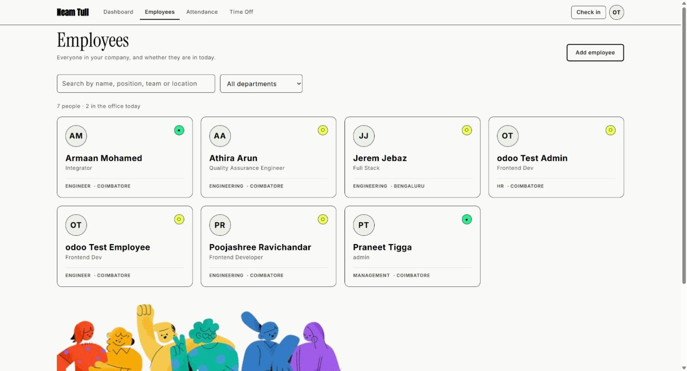
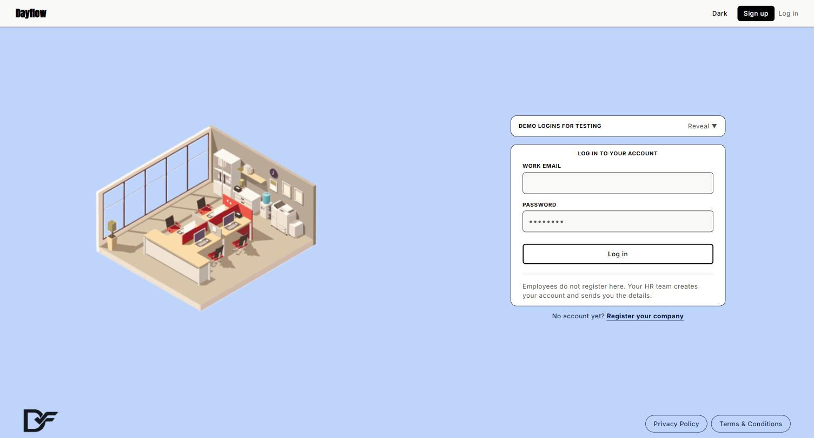
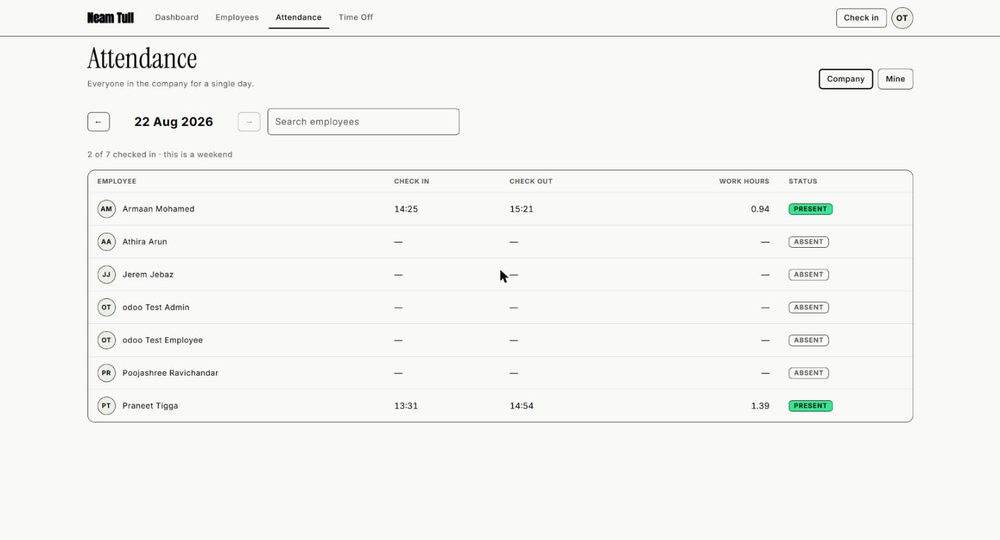
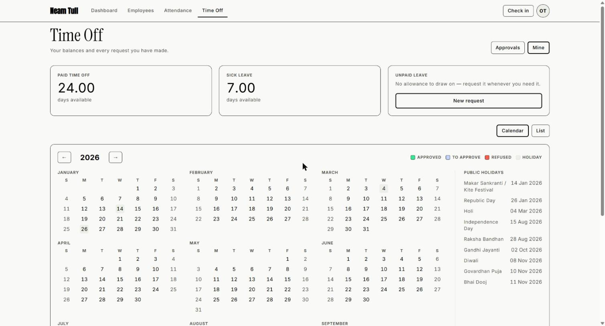
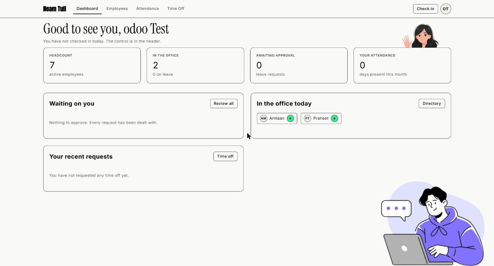

# Dayflow

### Every workday, perfectly aligned.

A human resource management system that keeps the four facts a company actually
runs on in one place, and makes them agree with each other: **who works here,
who showed up today, who is on leave, and what each person is owed at the end of
the month.**

### 🔗 [**Open the live app →**](https://dayflow-odoo-sand.vercel.app/)

Sign in with either demo account below — the sign-in page fills them for you.



---

## Try it

Two seeded accounts. The sign-in page also carries a **"Demo logins for
testing"** panel that fills either one in a single click, so nothing here needs
retyping.

| Role | Email | Password |
|---|---|---|
|  | `odootestadmin@gmail.com` | `DayflowDemo7!` |
|  | `odootestemployee@gmail.com` | `DayflowDemo7!` |

Sign in as **admin** to see the whole company — every salary, the approval
queue, employee creation. Sign in as **employee** to see the same app from the
other side: own attendance, own leave, own salary, and nothing belonging to
anyone else. The difference between those two views is enforced in the database,
not in the interface.

> These are throwaway demo accounts holding seeded data. Delete them, and the
> reveal panel in `components/auth/DemoCredentials.tsx`, before this app ever
> holds real employee records.



---

## What it does

### The directory knows who is actually in

Every employee as a card, with a live presence indicator: 🟢 in the office,
✈️ on leave, 🟡 absent. It is **derived at read time** from attendance and
approved leave — there is no `status` column to go stale the moment somebody
checks in.

### Attendance is the register, not a log



Check in and out from the header. An employee sees their own month day by day
with derived work hours; Admin and HR see the entire company for any single day.
A gap covered by approved leave reads as **leave**, not as an absence — the
register and the directory never disagree about the same person.

### Time off, as a year at a glance



A full twelve-month calendar with approved, pending and rejected days colour
coded, public holidays alongside, and the same requests available as a list for
remarks, certificates and cancelling. Paid, sick and unpaid are separate;
approving a request moves the balance exactly once, inside one transaction.

### One wage in, the whole structure out

Type a monthly wage and the six components recompute live — Basic, HRA, standard
allowance, performance bonus, LTA, and a fixed allowance that **absorbs the
remainder so the components always total the wage to the paisa.** On ₹50,000:
Basic ₹25,000, HRA ₹12,500, gross exactly ₹50,000, net ₹46,800 after PF and
professional tax.

Admin and HR set it. An employee sees their own breakdown read-only and cannot
see anyone else's at all.

### A dashboard that answers the morning question



Headcount, who is in, what is waiting on you — or, as an employee, your own
attendance and remaining balances.

---

## Stack

**React 19 · TypeScript · Vite · Tailwind v4 · React Router v7 · Supabase · Vercel**

No Next.js, no Express. Supabase *is* the backend; `frontend/src/services/` is
the contract in front of it.

## Architecture

```
frontend/src/
  components/ui/      shared primitives — every page builds from these
  components/layout/  app shell, header, nav
  pages/              one folder per screen
  services/           the only place Supabase is imported
  lib/salary.ts       the salary engine — a pure function, no I/O
  lib/dates.ts        working-day maths, shared so counts cannot disagree
  context/            AuthProvider
  types/database.ts   generated from the schema, never hand-edited
backend/supabase/
  migrations/         schema, RLS, functions
  functions/          server-side employee creation
docs/
```

**Pages never import Supabase.** They call services; services call Supabase.
One person owns that boundary, which is what let four people build pages in
parallel without colliding on the data layer.

**Security lives in row-level policies, not in route guards.** A guard hides a
screen; it does not stop a request. Every rule that matters — an employee cannot
read a colleague's salary, cannot edit their own role, cannot approve their own
leave — is a policy in the database, and the interface merely agrees with it.

The salary engine is a pure function over a single wage, which is why the Salary
screen recomputes on every keystroke with no round-trip, and why it is the one
piece of logic in the build carrying its own test.

## Team

| | |
|---|---|
| **Armaan** | Integrator — `main`, design system, UI primitives, router, shell, deploy |
| **Praneet** | Backend — schema, RLS, seed data, services, generated types |
| **Pooja** | Pages, illustration and visual polish |
| **Athira** | Pages, auth surfaces and profile features |

---

<details>
<summary><strong>Setup, environment and local demo data</strong></summary>

### Run it

```bash
cd frontend
npm install
cp .env.example .env.local   # fill in the Supabase keys
npm run dev
```

### Environment

| var | what |
|---|---|
| `VITE_SUPABASE_URL` | Supabase project URL |
| `VITE_SUPABASE_ANON_KEY` | Supabase anon key. The anon key only — the service role key never reaches the browser |

Everyone runs against the **same shared Supabase project**: one schema, one
source of truth, no drift across laptops. Only the backend owner runs
migrations, and destructive changes get announced first.

### Local demo database

For a repeatable local demo, review `backend/supabase/seed.sql` and then run
from `backend/`:

```bash
supabase db reset --local
```

This replaces **local** database data and creates the demo company, with current
attendance history and sample leave requests. All seeded accounts use the same
password: `DayflowDemo7!`

| role | employee | email | position | department |
|---|---|---|---|---|
| Admin | Praneet Tigga | `praneettigga@gmail.com` | admin | management |
| Employee | Armaan Mohamed | `amohamed@karunya.edu.in` | Integrator | Engineering |
| Employee | Poojashree Ravichandar | `poojashree@karunya.edu.in` | Frontend Developer | Engineering |
| Employee | Athira Arun | `athiraarun@karunya.edu.in` | Quality Assurance Engineer | Engineering |

Do not reuse `DayflowDemo7!` for real users — create employees through the app,
which issues a one-time temporary password the employee must replace at first
sign-in.

### Deploying

`vercel.json` lives at the repo root and builds `frontend/` itself, so when
linking the project **leave Root Directory as the repo root.** Vercel tends to
suggest `frontend`, since that is where the only `package.json` is — take that
suggestion and the SPA rewrite is silently ignored: the build still goes green,
the landing page still loads, and every deep-link refresh 404s in production.

### Checks

```bash
npm run lint
npm run build     # runs tsc -b, so a type error fails it
node --experimental-strip-types src/lib/salary.test.ts
```

### Docs

`docs/HACKATHON_PLAN.md` is the operating manual. `docs/SCHEMA.md` and
`docs/SERVICES.md` are the data contract — if something is not in them, it does
not exist. `docs/BUILD_RULES.md` goes into your local, gitignored `CLAUDE.md`
before you run an AI session on this repo.

</details>
